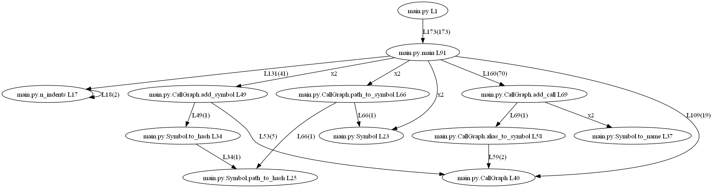
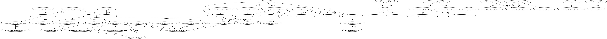

# What

Run a static analysis of a code base, to generate a static call graph.

Tested those languages (images at [doc](doc))
- python
- gdscript
- configure additional ones in [lgrey/config.json](lgrey/config.json)




# Install

## Windows

```
choco install Graphviz python

python -m venv env

env\Scripts\activate

pip install -r requirements.txt
```

## Linux

Not tested!

Installing Graphviz should be easier than on Windows according to their documentation.

Then:

```
python -m venv env

env\Scripts\activate

pip install -r requirements.txt
```

# Usage

## Example

Generate a .dot graph and a .png image:

```generate_graph.bat lgrey```

To generate a .svg, in [generate_graph.bat](generate_graph.bat) replace all occurrences of 'png' by 'svg'

Notes:
- The extension (.py, .gd, etc...) to look at is automatically infered based on the content of the repo.
- The type of indent is automatically infered.
- [lgrey/main.py](lgrey/main.py) will generate a standard .dot file. It can be transformed into an image using graphviz's dot or used by other tools. You may also manually edit the .dot before running dot (eg to remove some edges).

# How

Generating the graph roughly follows those steps:
- look for keywords at the start of stripped lines (eg 'def' and 'class' in python), and mark those as symbols
- look for called symbols inside of caller symbols, occurences are represented as an edge in the graph
