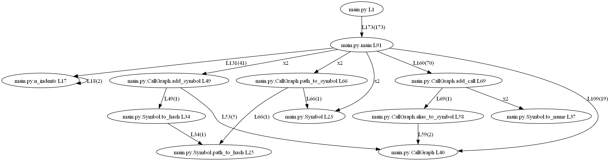

# What

Run a static analysis of a code base, to generate a static call graph.

Tested those languages:
- python

# Install

## Windows

```
choco install Graphviz python

python -m venv env

env\Scripts\activate

pip install -r requirements.txt
```

# Usage

## Example

```
generate_graph.bat
```

Example generated image when run on the code itself:



To generate a .svg, in [generate_graph.bat](generate_graph.bat) replace all occurrences of 'png' by 'svg'

# TODO

Try gdscript
